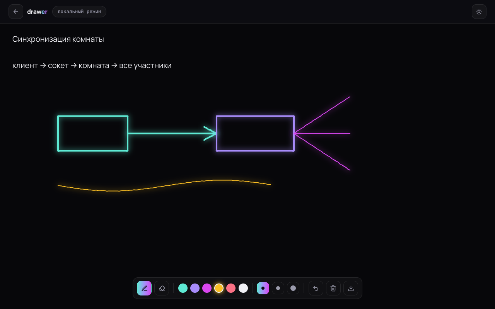
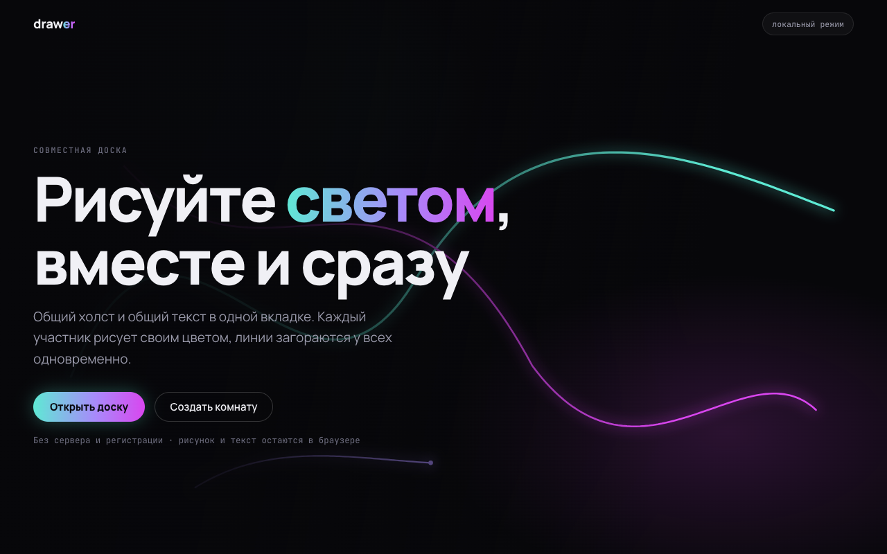
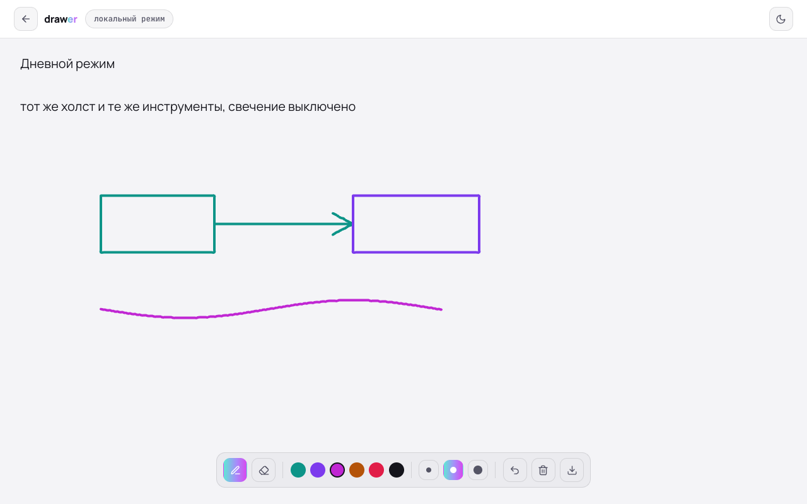
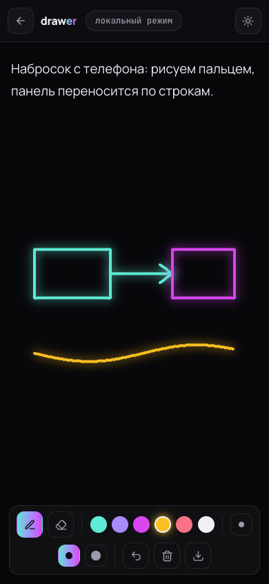

**Живое демо: https://olegg000.github.io/drawer/** — открывается сразу, регистрация не нужна.

# Drawer — совместная доска в реальном времени

> **EN (short).** A realtime collaborative whiteboard: several people draw and type on one
> canvas at once, and every stroke lights up for everyone instantly over WebSocket. Each
> participant draws in their own colour; strokes carry an id, so simultaneous drawing never
> overwrites someone else's line. Pen, eraser, six inks, three widths, undo, PNG export,
> night and day modes, PWA. Frontend — React 19 + react-konva + Redux Toolkit; backend —
> Express + Socket.IO. The GitHub Pages demo is static, so it runs the local mode; shared
> rooms need the Socket.IO server from `server/`.



| Первый экран | Дневной режим | С телефона |
|---|---|---|
|  |  |  |

---

## Что это

Общий холст и общий текст в одной вкладке. Несколько человек заходят в комнату по ссылке,
рисуют и печатают одновременно — линии и текст расходятся мгновенно через WebSocket.

Оформление — «световая доска»: тёмный холст, штрихи светятся цветом автора. Днём тот же
холст переключается в светлый режим, где свечение выключено, а цвета подобраны под бумагу.

## Возможности

| | |
|---|---|
| **Совместное рисование** | Штрихи транслируются всем участникам комнаты в реальном времени |
| **Свой цвет у каждого** | Шесть цветов и три толщины; цвет и толщина едут вместе со штрихом |
| **Общий текст** | Текстовое поле синхронизируется между всеми участниками |
| **Ластик** | Убирает штрих под курсором — у всех сразу, а не только у себя |
| **Отмена** | `Ctrl/⌘ + Z` и `Ctrl/⌘ + Y`, история на 10 шагов |
| **Экспорт** | Кнопка сохраняет холст в PNG с фоном текущего режима |
| **Ссылка-приглашение** | Клик по названию комнаты копирует адрес в буфер |
| **Горячие клавиши** | `B` — перо, `E` — ластик |
| **Ночь и день** | Переключатель темы: свечение или светлая бумага |
| **Локальный режим** | `#/Draw/local` работает без сервера, текст хранится в браузере |
| **Мобильные устройства** | Рисование пальцем, панель инструментов переносится по строкам |
| **PWA** | Ставится как приложение, работает офлайн |

## Как устроена синхронизация

Каждый штрих получает идентификатор в момент создания:

```ts
const newLine: Stroke = { id: newId(), points: [x, y], color, width };
```

Дальше все события адресуются по этому `id` — `drawLine`, `updateLine`, `removeLine`.
Это принципиально: пока участник ведёт линию, клиент дописывает точки в **свой** штрих, а не
в «последний в списке». Без идентификаторов два человека, рисующие одновременно, дописывают
точки в линию друг друга — классическая ошибка совместных досок.

Сервер держит состояние комнаты в памяти, отдаёт его новичку целиком (`roomState`) и
ретранслирует события остальным. Пустые комнаты удаляются через минуту после ухода последнего
участника.

## Стек

| Слой | Технологии |
|---|---|
| Клиент | React 19, TypeScript, react-konva / konva, Redux Toolkit, react-router, framer-motion, CRA (PWA-шаблон) |
| Сервер | Node.js, Express, Socket.IO, TypeScript |
| Транспорт | WebSocket, fallback на long-polling |

## Быстрый старт

Только доска, без сети — как на демо:

```bash
cd my-app && npm ci && npm start
```

Открыть `http://localhost:3000/drawer/#/Draw/local`.

Полная версия с комнатами — нужен ещё сервер:

```bash
cd server && npm install && npm start   # порт 8000
cd my-app && npm ci && npm start        # порт 3000
```

Клиент сам находит сервер по адресу `http://<hostname>:8000`. Открыть один и тот же URL
комнаты в двух вкладках или на двух устройствах — и рисовать вместе.

Сборка клиента: `cd my-app && npm run build`.

## Про демо, честно

GitHub Pages отдаёт статику, поэтому на демо живёт локальный режим: холст, текст, инструменты,
экспорт, темы. Сетевые комнаты требуют запущенного Socket.IO-сервера — если открыть комнату без
него, приложение показывает плашку «сервер не подключён» и предлагает локальный режим, а не
пустой экран.

## Структура

```
drawer/
├── my-app/                 # React-клиент (CRA + PWA)
│   └── src/
│       ├── Pages/          # StartPage — первый экран, DrawPage — доска
│       ├── Components/     # GlowCanvas (живой фон), CreateComponent (создание доски)
│       ├── abi/            # ServerABI — обёртка над Socket.IO-клиентом
│       ├── styles/         # lightboard.css — палитра, типографика, стекло
│       └── types/          # BoardTheme: цвета участников и сила свечения
├── server/                 # Express + Socket.IO: комнаты, штрихи, счётчик онлайна
└── .github/workflows/      # сборка и публикация клиента на GitHub Pages
```

---

Студия Лендвис · [landvis.ru](https://landvis.ru)
